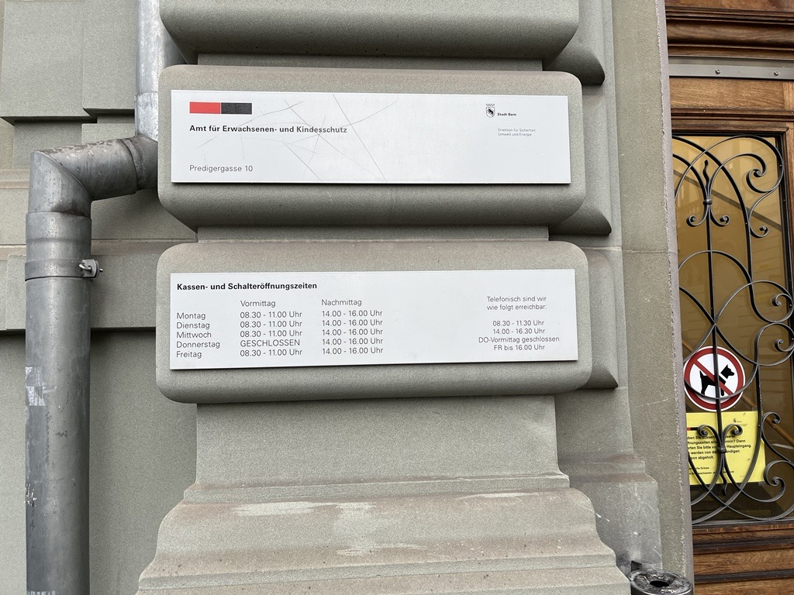

+++
title = "Radikalisiert das Internet Jugendliche?"
date = "2023-04-06"
draft = false
pinned = false
tags = ["Deutsch", "Reportage"]
description = "Die katalysatorische Wirkung des Internets im Prozess der Radikalisierung\n\n\n\n\n\n"
+++
# **Radikalisiert das Internet Jugendliche?**

#### *Die katalysatorische Wirkung des Internets im Prozess der Radikalisierung*

*Von Julian Gassmann und Adam Balsiger*

### Einleitung

2005 war das Jahr, in welchem der damals 16 jährige Christian E. Weissgerber zum Neonazi wurde. Schnell wurde er, in seinem vergleichsweise kurzen Aufenthalt in der Neonaziszene, zu einer der bekanntesten Personen darin. Er selbst fand seinen Einstieg in die Neonaziszene durch Musik, genauer gesagt die Schulhof-CD der NPD. Vor allem ein (ungenanntes) Lied faszinierte ihn, handelnd vom Vaterland Deutschland, der Heimat. Das Konzept der Heimat faszinierte ihn möglicherwiese so stark, weil er durch seine schwierige Kindheit nie wirklich ein Zuhause hatte. Später wurde er Mitgründer und Leiter einer Rechtsextremistischen Organisation, der PVJ (Pakt-Volkstreuer-Jugend). Für sechs Jahre lebte Christian aktiv als Neonazi. Bis er durch den Umfeldwechsel, seines Studiums, sich mehr und mehr von seiner Vergangenheit distanzierte. Seine Erlebnisse verarbeitete er zu einem Buch «Mein Vaterland! Warum ich ein Neonazi war». Die Geschichte eines Jungen in unserem Alter, welcher in eine solche radikale, hasserfüllte Ideologie glaubte faszinierte uns, verständlicherweise, sehr.  Eine Frage welche uns sofort beim lesen in den Sinn kam, war wie sich die Rolle des Internets, seit dessen Einführung in die meisten Haushalte, im Radikalisierungsprozess  verändert hat.

Als ich am Esstisch erwähnte, dass mein Schulkollege und ich eine Reportage über Radikalisierung und deren Veränderung seit der Einführung des Internets schreiben werden, war die Antwort auf diese Frage für meinen Vater schon klar: «Das Internet ermöglicht noch nie zuvor gesehene Mengen an Kommunikation. So können sich extremistische Ideologien viel schneller und mit einer viel grösseren Reichweite verbreiten.» 

### Radikalisierung im Internet

 Schon nach kurzer Recherche zeigte sich, dass es im Internet nicht an Extremismus mangelt. Durch den Text «Digitaler Wandel, Radikalisierungsprozesse und Extremismusprävention im Internet» von Prof. Dr. Rieger, Prof. Dr. Frischlich, Frau Rack und Prof. Dr. Bente erfuhren wir, dass zum Beispiel der IS (Islamische-Staat) zu Zeiten seines Höhepunktes hochprofessionelle, hollywoodartige Filme produziert hatte. Christian E. Weissgerber hat selbst auch propagandistische Videos erstellt, auch wenn die nicht gerade hollywoodartig sind. Es gibt sogar Videospiele, welche, erstellt wurden, um extremistische Ideologien zu verbreiten. Aber das Internet bietet nicht nur extremistische Unterhaltungsmedien, sondern auch Nachrichten in Form von sogenannten «Desinformationen».

![Bild 2: Extremismus im Internet](data:image/jpeg;base64,/9j/4AAQSkZJRgABAQAAAQABAAD/2wCEAAoHCBUWFRgVFhYYGBgaGRgaGBgYGhgYGhoYGhgaGRoYGhgcIS4lHB4rHxgYJjgmKy8xNTU1GiU7QDs1Py40NTEBDAwMEA8QGhISHjQkJCE0NDQ0NDQ0NDQ0NDQ0NDQ0NDQ0MTQxNjE0MTQ0NDE0NDQ0NDQ0NDQ0NDQ0NDQ0NDQ0NP/AABEIAL4BCgMBIgACEQEDEQH/xAAcAAABBQEBAQAAAAAAAAAAAAAEAAIDBQYBBwj/xABAEAACAQIEAwUGBAQEBgMBAAABAhEAAwQSITEFQVEGImFxgRMyUpGhwUJysdEUYoKSBxUj8DNDorLh8TRT0hb/xAAZAQEBAQEBAQAAAAAAAAAAAAAAAQIDBAX/xAAjEQEBAAIBBQEAAgMAAAAAAAAAAQIRMQMSIUFRYQSREyIy/9oADAMBAAIRAxEAPwDxoU4CuLTwK0HKNKSCuoNDXUGtRDbw0FWnZZlF8ZojK24nXf7b1X4gd31ons6xGItwSNSNPFT86eh6EmGB0AKAwZBcT0MGQasMMWVgRLeJyjT/AH4VVoXGx0XeVjXyBo/D3HIMpGn4YB9BynyqAvit8tDWzOaF7sERzOUHl96G477S0iIjlbjiWcH/AIaAbKeRP2pl5G0ARjptznXQE8tKrMdfYqJXJ3GQr95J5zQYnEYz/Vz2wyBT7ysxYnmxM8+leh9ncf7S0rPEq2pA0LH8ceI+WtYW3hwFGu/jWw7J22KZVP4gw5hoYiPl+tBqr7hdTtHSq21w1HCu6DMVBg6kADQGpu0V8iyQphyvvLoRAk6jadqg4X2bxd22lzMgV1VxNy6TDKCBQEW+GIPwL090VL/lyD8KgeQrlvshiR7zpPQm6w+rVPh+zeHTMMc6BQAwIdraKpJXvsxMmdqCA8PU8h56VCvCFDK6xKsCNhsdp5T96vcdwnA3x7DDXUW+mXNqbjZDzYMZO41G0iq9f8On54lee1pefmaC2V0dcyagjrqCRsRyPhT2IkmBsDI1IjkTy3qv4HgzZR7BIm27jMBBaSSGjlpA9KKxDkaEDbyPrroKCt4zbD2brruqysamVIbWfLbWsQ91Q/vgMeQZOYJnQdPGtdxrGhcPfJ0VUhgCYOY5Ttqd5rzpu0a7D9XmaDTdnsTcGGdEVO476sHMTBMZT41JwYEYpc4liBM9TofLepuyOdLFxspVXeQOeaIJM7AiKZbv5MQhmZKyxM6gzH1oNXjBkXOkowI7wMb6Hz32is7xJDlOhklYLLmBhhJkiOfMVpsTcRlKhhmMR5zVJx1hbw9xmQvCEnIATGikwSNBOschQeR8ZfNdZojMFMd34QPw6cqrqsOJ4pbj51XKMoEbbT4nwqvrUHKVKlRSpUqVAqVKlQPWpAKaop6ioh6CuoNacgpyrrUDcQO6fSm8LuFbyEaHMPqY+9T317reX3FB4Mw6Hoy/qKs4I9Kww1UakGYGhE6Zp6b86s7LiPwmDsdBvzy7iq1XUkkzImIMeUabaUVagyNzrC7n56TUCW4gzEKp1kj9IAXbxM0Hi7gunUsBoIkHWOvT9q6boQmIY8tJGmkRO/ga62BuPbVlZgwYqwyhfFdTvyoMecKmYnKDDazz70Vt+zWU2CFhALhgLECYPpWfXs3iJLZYMkgllHPferjhGAe0YYrGvdBB5b6eVBpMfbU2yN5WPpWu7K//ABLHggX+3u/asfiHlR+X61rexz5sMvg9wf8AWf3oLe6wA12rKcXuWLrhbqI6nRUcTJEnNGx8j+9X3H72S3qYBOpOggamTy2rwvj3aBWxqOWz20eAF1GQwrsOpILR6UV69g8eFtPdv5LIEI1zJkIQCBqRmBAA5kHkavuD8XsYq37bDuHTMy5grL3l3BVwCNxy5ivn7GcatWxfVWN83VKqzMSqhh7xzbt4fOrLsB24OAR0a1nS46sIbJkgZWjQ5pAX5UHq2OXLeuRpLA+cqDVfffUiJ66HXxmf960Jhe1WGxdyUbIzKsI8AlgIIVho23gfCi8SCSNDEsDoToBJYwDCjmfGiKDi9guGWBldcuUAAz1PWs5b7DuCGFsmII25a9a1993UAABTmB93vHnAnp0qwTiLhSzFzH4cpkiN59DoKClS4wVkKx7um0HKP2qhd8l5CSGloG49dd9qucRxBL8OuYAkqRHeA8D6iqK/YaUB1ObKI0OswYbQctaDdYpEaHkAxpECTuKgayHR9Z7h0MnQ76URZwZKqHMkAeMGBz5+lV2CuMGOfo6mNdOWlB5R2hwqo6BRHc1ERqD/AOao69A/xLtrOHZFgEXBMAT7hGo3515/Vg5SpUqqlSpUqBUqVKgnUa1IopgGtTKKzUPtjWnBdRXUGtSMuo86jLtxO435T+lU9X4SQR4H9KoRVix6lgr4dQYgtJAO+nPTlvRJO8z4d5vWJqo4a4FpGzalEOh2lQY+ZNWnDrftmKlwg0mQSTJAgAHx8KKdwrBNfy5SIU6uMrAeEeU1fXcEqIQSzjUhBAzHQCCNuW/jUtzgyMPdRWAVZXTMByaADp60HxfC3Et5bLWlYgjNduBVXyEST40DxgEC5ntKG2IJzgRrKkxIIPSocLbsu0GEUd2UgHMRodQQa5whMbBW4+GdCRql0sQIiNFM66+tSWuFOt72jujopkImca5cupYRv5xQD4q7bspmu3AiyVDHWWk6D5E1ouyfaDDsnsrBSVymO8C+YnM5iZkj9K8143x5rGKYKFZLDFlVu9DOhkZo3GY6xyqm4jxbJlWzbRHWM11MwZyUIYlp7oJaSs+8oNBov8Tu2bX7rYW00WUMOR+NxGYT8KkR4meUVnrHApwhxJJAdltozW3IZ3BPs7agEmI1c6TooJkjMZta9t/w17Q20wi29CE1eBJXWWJC9dADzYrPvUGMtdjSt9rVsG4f4Zbym4F9m+a37RrWYRkaIhg090nY1k8YoV3ADLDEZWYMRB2zDQ+dew8U7RrZsWEYqq2S2Hd2BaXSy9q4mXUtDKOQDC4sHRiPGcdeDu7LOVmYiYmCZ1gAfIUKbbuN+FoPjH3rWcP7bYtFVHdHVQQM4XNBXL74Op0GpBmNaxUc6lggBpUzOnMR1FB6Xb7XYW8qG6j+1tpo4AKs5IDZSrArI11BGkVL/ndm4t9PbG22SLDi4UzPkMlgNwSwEHTQneK8vN9ojbypqk6x6mdaDbdj8JicQ2QMyW1gux0AY6BUDaFzHlGp8dZxbg9tHi5ivYuzdwFDkU/hQXHjMfGQfCsx/hnjlzvYZC2Y+0UhypBACkRseW55GtVx+xZvhsGb6pcue6pAYB1KsqswG5gaZuvlQUfEO0mLwtz2N4oTqVfKWzqSYYNInptpFXHZ7ij3rIuPKszOMyaDKGIEidNB4zWd7SYF0weFF8f66NdTU5pRSY15iFTWrXs4ALCLmJ7inRQPeUGCW3Ou9AD/AIkvmt2TuA7946k5l6/0/wDivNjvXo/b5P8AQQyTF1Z1U7o4/CPKvOW3NWBldrldNVXKVKlQKlSpUBRFTqKjYVOgrFQ9BUjrTUFTutGUttazxEEjoa0loVQYkQ7j+Zv+41cVjRYTFItpO9rlEiDuKZiMeXuWSn4GR+hzKwMfQUb2Y7NribRuNnEGNMoB1OxidI186P452ctYbDtdGbPKhZJIMnUED+XNVV6HjscLdl7vwIzjmDA0QjnrpWXwHBLVy0Mbj3Lsy5++02kQ+6FG4kRp47UfhLgxWEy7e1taeDFfs1VfA8MMUVsYlwFsAIuG90sV0zN8XTT6DeCwtdlQ4t4nh7LYclWU5bwtuuh7wyQNDP08as+3PFhhLCXSjMxcWyo7iFijNnWQYHdOmtC8dxqYOHtG2HJULaYSx1iVKw4jpMcvCiMYrXbaPjAtx4zZGVSiEzAVDoCAYJ331oPEb+OdmdpKl2LNlJAJJJ1E8pMUM1wnck+ZJq97T4e2lxlFvKzMbkgwvs20CqsaagmfGOVB8MGjjKNVzKYkjKeR5UAeFwzXHRFjM7KizoJYgCT6ij8O5w92GzW7tt4JCq6yrZhmRiASrBSNwYGmmt92UvIXt+1Vio9obYGoW8WtlXgHugECqDtFdzYvEsdzeu/LOwA+UUEmNx6swuEtefTv3ERBIiGdFZvaEjSWI2EzVU5LEk8ySfM6muTSWqCLdi4LTXB7hZbTnTc98CP6JnwqG1ZZmCgd4kAA6akwBrtrWj4ZZz4FrQgNcxllJOyyjZT85HrVPwy3lxKK8rF1FcnlDgGagOw3BkK2yxcMxdXAghSrEchoIGs0BxvAizfe2JyqRlJ5qQCD4716Fi3tWHe17RAM7sHBEd9FaGkyO8zTWa7S4629+7cDqy+wVbYDBoLrqARsQS0jxoKrgd+7ZvWriKZJIUHQMOYk6HRvrWuvYnh5PtL9u/bJOZkWcpaZOqjST0I9KybcSU27IOXNbIgQxMT3p0jYCjuI8Ww7WmRC5YgAHLAGoPM+dB3tRx98ZcDBCttVKopnRZGZieZPdk8oA8TouCcQKoMyAqEQBmDad2CNPKsvf7QqWQqhAQMBBCnUDmNtQD6VB/8A0TzPeP5nY7elBqu12LV8MR3ZzIRA/m/Y155dHeNWmM4y1xSmS2qs4fuhiwOgyhmYnL4Gq2/7xqwRUjSpGqrlKlSoFSpUqCwcVMgqNh+lS29qwiVBU7DT0qJBREaD1oyksDQVRcSWLref6gH71fYfYVTcaSLp8Qp+kfak5Wcr7sxxN7aCHIUM0ryMwaL7U8b9uiLqAGmTpOkfc1jRiGUQrEAzMGKja8x3Zj5kmqrb8H48MKlu26HLtnUzDFpMhuWvI8tqseM8SwF7v3FYOB7ysis0bfi19ZrzMmlRXoPDeL8PsBbyozOWjvsrum4zZQYHmBOtG8R7b4cuijM6Fu+RmELI1grLDcwI2rzKpFsMdlJ8gaWrMbeI0PbDimHv3luWC5GXK2dQux0gT4mq7B8RW2HAQsSqqhYxl+OQN5kxQP8ACtzEeZC/rXThjzKj+oH6Ak1Nz6vZl8GcP4qbUFVMjmGA+HSCp5qNooPGYg3Ha4QAXZmIEwCxJIE8ta57JfjX0DfcUslv42/tH/6ps7L+f2gmug1Nmt9GPqF+xpe0Tkk+bE/pFN/h2z7HFxDAQGYCQ0AkDMNjHUdaY7EkkmSdSTqSfOplY/htj+1m+hJFT2heGqqB45UB9CRIptLJJyAidqmXCXDqEY+St+1HZMQd2Yf1wPktcbh1xtWeT4kt+tXbOwn8E495cv5yqfIMRNdGEPN7a/1q3/bNFLwnq3yFSDhaDdj9BU2bgBbCc7q/0q5P1UD60Tb4WzIHWWUuLeYhFGcgEKJaToemlStg7Y/9mmNkAjSN45T1ihLA97CFVzHk5QjfUTOoGU7HZqixPvfKiDdQbD6ULeeTNagionAjvju5oDEL1IBIoanqxBBBgjYirVJhpPiajrpNcoFSpUqC0jT0qW1tTFGgp9nasMJ0FEoNBUCipy4C0D7TACqXjTS4P8oHyJqwUzQXFkMK3LUH7fek5WAARzBI8CB9YNWd7huS97BxbRtNWuqUAIzAs66CRHQidYqppyirrbpMtLD2VvI75rIZXCqn+qzONZZTquXQbnn8+57QC/6haZzBbSCOkE/71+YqYVzsjn+k/rRCcMvHZI8yo+9TUTvvq6D3b7ScrPl5SYMeMaVEwc7knzM1b2+BXTzQebE/otCYyyEYpnDMN4WFB6ZiftTU9Fzt5oMWD1FPGF8a0ScBSBmdzoPdygemh0ouxwOzzDN5u32im2dswuCXmTUq4a2N49TTsfZVbrqogBtBvp60reisImQNekN/sUDwtocl+U1IjqTlRST0VagtrvWi7OaI/wCYfp/4omgaYC78AH5mH2mpRw9+bIPKT+1WzvULvWUVF2yVBObbwqrOMfrV3eca1nX0J86sWQ9r7n8RqMuTzNcmuTVU1qYae29MNUcIqM1JNNYVVMpGka6aoZSpUqBUqVKguE29afYG9NtjQ11WgmsMCC8UyZpgqVRQdQVIBy386YBTgKBLh1B0VP7RRVq5Gm1QpT0G9QFB6SNp60IWKmntfXIxJAEH9KjSSxjHcgrb7s+8WAkdQOdVb8KVXzXHXKTMA95vCKJ4fedrSrmCKBEjVzHTktFWURT3FJJ3YyWPmxq8Cf8AiHaMiQPifuiPBRr+lR5Mxys73G5oncQeZH3NduC45yAFV5nYnwHSjcNg2AgQo6CoMvj7WS6ywF20BJA0HM1xaL4/ay3yOqqft9qEU1oSgVa8Dc5mQbtEeYnT/fSqoGrjs46TcVyRKqVI3BBOo8dayLJsI53IFIYDqSanGPymCM4+NdD6qftUy460d2y/mBX67UAH8Eo/CKHfBITqoq2OKs7+0T+5f3oQ4u2fdJf8is31AitJtV3+EoQYEUC3CAVLAgAaidyOp6Vd4x3fKi2yudolyBoBmOiyYgR61LeshAHuHO0jJbAhC3KV3YTyO+gis26m1xlt1FTh+C2kUPfBYsJS3mK907O5EETyUR1PSpP8uwbEHI6jmq3CV/6gT9alx3DrrsWuXERzqQ7Mz+qopjyNNTCov/MJ6wmk+BLT9K43O87evHDGTWtob/Zqy8mzdKnWFud4eWZRIHjrVDjuE3rWjrpyZe8p/qG3rFaeba6hmJ8sv6E1La4mCYKrHUT9zWseplOUy6WN48MEVO0a10ITsD8q3N8W3PfRGX4huPHTWhr+BA9x/wClxI9GGo9ZrpOpK5ZdPKMiMM3wmunDNV7dDD3kI8V7w+mv0oYlT+IeR0PyNb7nK7nKpNlulc9k3SrY2PEU3+Gps24rV1KHR6mRHOymoCFqQNTUwjnoKIt8O+J/lWREHHWu+3Wj7WAtjcFvM0ZbRRsij0FXYpA7HZT8qnS1cPIDzq3NlTyjypww55GoKc4Nm3b5CnPwkFeZIIOp0NXC2WHKfKu66yIoK/h+FULAiZJip8ViVtQHOrTAHON/1qfD2pWOhNDcU4e7pkIBP4XIkjUSKCJuMKRohPiTH6VwcYfkFHoTVUnBcSPcXNHJSJ/tNRpduqcrprtqI+u1F0l4mz3HDsdYA25CennUSWDVjYtu+1tz+UZh/wBMmiLWCY6gaek6efPwps8KxMPVlw/ChdeZovBYFWiSddQNB5SKNtYRkcI5QA7Z1ZJnbKx0YbbE1Nm0QQc66+GMTDR+Un105eNGpayXAjF1Ur3VlXB2OYZmDAajTaphhfYP31GR9riTEgxpkzKreusnSam02preCdpe33t9UnWNYmIJqXAvdaQXKkQe+vdPgCNSaOxFkI5TMXBJbLORwWMlrgdV1OuoHrUN+9kbVQBqQGGpA+EnMGPLl5VdnJqlHlmuEFC2UoogggQ3eM67ZYnQ686HxHEQvuCGiDcbV/HL8A32+Zqn4px4uQiIEUbKFKgE8zOpPiZNV/FbZWCHDSJOojwgCdI5z8qxZlly7YTHHzfNGnFqDMGJgtBgNvBPXnXH4gg1mjMdYZsJbtW0YAHMA8qZIJZoaNydxp0qqHBLpVc5CxOUQp3M6kHXWnbj7rpOpl8PbFqdZHX0pTOtEO+LgKwtuBszBNB0AkAfKhFwVwDvFV9Z+SjT61LMfVXHLK8xKt8r41NbxmkGf2oNkAHvFvkPpULNUkao25ivGhr2IFCPJ2qNrbdK3MXPKu3Li/CPkKjzj4RUTA0yuna53S/tOOUekUQj1BbwI5Ej/wB/rRSYd12AbfSJ56ARB9TpUcj0NTKp6U+xc3zIQBoW5DrrEfMirC1kIBDLB6kCgDSyelFW8KaLtunxD0k/pWZxPai4cyoqpuASCxHLnoD6VdDTW8GaI/hAozMQoG5YgD5msQ3FsQy5mutppKsR9Fp2QXRq5c/1Ez+tQbN8XhkBLXVMCe7L+gyzJpuG47h2MIrvpuciCeQOZpHyrGWLOUQUf+4R6U/CpmDlnyd73QAWJPUzFKuOO61a9oJMfw9oRoSzh5PgyxpVY9665MugmYCE5R4dfWgGw6AAB2/tH70UnDHjNbdX/l91/kdD6VyuTvjhIQW7a3UgfEveX5j71a4TJeHfUT8QEn160FgLjiZleXMa+INdy3QZDqB4ED6CsN3S1w1q6mivKjb3gR/TFWXs7biLmrfFlg+h3+dUljHuNC2ajrfEU5q3zmspfInEcER9VcqRsWAbrud+fI13FcOfIIyOw5oPZNz91lJn+oGa7h+JLsqtVpb1EsFHrr9Kd2US4Y1VX7JeyFkK6jW1duowJ6sjiJ22dafbsC9bjI1u4g0dLPs10GgDK4VhpyJHnVuqoOevWnXcPbuCGzHxzNp6TB9RVmbN6fys0bguAWb+jKYQs9wsTtIV+4eWw51BiMKyAyQyLOU20T2irPLMN/yz5VpH7NowAFwiDmWQDDAESPHWgsT2Xc+7iPoP0MiukzxY/wAdZfiuFQN7pc9XZSunSdTWfS6lu6jHJlDqSACdAfxA8q2OK7D3H/50+BJj5bVXX/8AD29ydasyx+kwynodj8YrgkwZBPXcb1mbl5ttZ0ira12ExC6C8QOgOnymlf7IXUEvd09Kmsb4ld71NTdioDk6TNdOFuH8Jq6w1u3bEKJPU098d0rc6bz5fyvkUB4W/MRTLuFRd2k0VxXiJ90GqK9ercwjnetll+JsRi1XRRVZcxTNzrl0Hc1KttYmt6kTfu+UJcjfWuSK5cInSmVWmiHEAOg89f2rj8XMd0knkF0+oFRWUsg65yfJV+u/1o/DHD5tjP8AP3v1Jiuer8S5Y/QFziNwqRkJJkbltx03p2FOKICgZQOZj7mtCj2xsq+gFTLi1Gyj5Cm0t+Kqxw3EN710j8v7gLFFXezKspOcl9wXOh8CYn11ow408gPlUT4l+lXuTTJ4nDPabK4Knx2PkdiKajqeZQ9V/b9q0GNvuylSoIPUVnHwrrRqVYJdYDVVcddTHmDUWNunusjKeqKuWKFt3WU8xU7YhT7y69Rp8+tTSy6PwmODNDaGra1cI1U1mMSBOlWXB8drkff8J+1Yyw8bj0YZ+dVcm87HWT4zUqNUbTUqJXF10mRqmRqgSpFahoYuIy7b10Ytp3NCk0xmovbFrbxp60YvEI2rPZ6et2iXFpU4ietEJxKsoL9dOKNTUTtrYf5lXP48bk1kDjD1pjY401DtrWX+JgAmax3E+Ju51J8BSvYolTVTduwda79PGSbeL+Rld9qW5eIHjQz4jKCedQPdmhr9yu2nCI3ckyaEvvUpNCu0mq6YwnM01mp7Como3HKdTaVGmkS0w95J/Kyn9qIW8g0KEeY+4qjXh9z4frTzgLw/B8prDHjlobTWT8I+lFJYt8nj+qs0mGvf/WxqZMLf5WmqaNtOmEnVXnlsDr0pt4OpAAU9Z0qlw9jEqQQjLrMzsesDnV3bwjn8Tz1ZaWE8ue1MaoD+U/YimFEbe249AfvRqcKuDZ1bwIIp38LeX8APiDUXSmxHDrR0mPAg1V3+Dk+4RH+/lWsyvP8Aw2HpP1FTLg2cQwCDx1ars1ph14BdPSpB2dca6zW/w/D0TaSepoj2ANNm2FtO6aOpP8wH60XbvqdjWsfBKdxQV/gdtvwwfDSsXGV1x6tnKkzCnC4KNudn/hdh9aFucGcbNPmKz2V1nVxPVxTWNB3cBeXYj601Lzro49RUuNanUgomuZqYHBpE1jTrs/NTS9MJpjNQPd6id64zVEz1NG0rXIU1VXnk0bdfumqy4a9WH/L5vX851xnqBzXWamMa6OcjjnShBvRFw6UOtHTHg9jUZp5ppo1DaVKlRWyttUiO/wDL9aAFvoSKlW03xVhiyLFHc/D8zU6Z+o+dV6WG+Kj7Kx4mhr9FWM/4j8qNV6BQ0QhoDUc0Qj0ArVMlyiLFLlONtTQS3h0qRMVrEVnR5SNajakpqYrNDNoaNROppxFQKafmqKdAqN0+VSzTVMigHewKCxGCU8qsiIpjCtbTbM4rhJGqGPCq1y6aMI8a2TrQt7Dq2hFS4yumOdjLi4DTS1HY3hYElTHhVO1wgxXK46d8epKlZqjdqablMY1NN7ddtDVfcaiyd6Ac13w4eLrT/Y1jTCaTGmE1tjTlw6VEtPc1GtVqcHGuGka5RXDSpUqK/9k=)

> *«Desinformationen sind absichtlich verzerrte oder frei erfundene Inhalte mit überdauernder Täuschungsabsicht, etwa frei erfundene Gerüchte über Straftaten von Geflüchteten. Manchmal werden Desinformationen auch als „Fake News” bezeichnet, allerdings sind Desinformationen nicht unbedingt „fake“ – oft werden kor-rekte Inhalte in einen verzerrten Kontext gesetzt oder mit irreführenden Überschriften versehen…»*

Diese stellen ein riesiges Problem dar, da sie sich oft schneller auf Webseiten wie Twitter und Facebook verbreiten als die nicht «inhaltlich verzerrten Nachrichten». 

Bei unserer Suche nach Experten zum Thema «Radikalisierung der Jugendlichen im Internet» stiessen wir auf den Leiter der Fachstelle Radikalisierungs- und Gewaltprävention der Stadt Bern, Roland Knöri. Die Fachstelle hat das Ziel, Fachpersonen oder Angehörige von Personen mit Radikalisierungstendenzen im Umgang mit diesen zu beraten. Der Umgang mit Radikalisierung der Jugendlichen im Internet ist folglich ein Teilbereich von Roland Knöris Arbeit. Begeistert von seinem offensichtlichen Fachwissen, riefen wir ihn sofort an. In einem angenehmen Telefongespräch konnten wir einen Gesprächstermin mit ihm vereinbaren. Wir lernten Herrn Knöri im Amt für Erwachsenen- und Kinderschutz, Fachstelle für Radikalisierung und Gewaltprävention der Stadt Bern persönlich kennen. Wir trafen auf eine freundliche und motivierte Person und in einem 20-minütigen interview konnten wir viele spannende Erkenntnisse zum Thema sammeln.

Die wohl erstaunlichste Erkenntnis, die wir in diesem Interview gewannen, ist, dass man davon ausgeht, dass trotz dieser riesigen Menge an Propaganda noch niemand ausschliesslich durchs Internet radikalisiert worden ist. Radikalisierung ist ein Prozess, der über längere Zeit stattfindet, und meist damit beginnt, dass sich die Person in einer persönlichen Krise befindet. Herr Knöri habe deshalb noch nie einen Fall gesehen, in welchem die Radikalisierung isoliert auf dem Internet stattgefunden habe. Dies benötige meist Kontakt mit den Ideologien ausserhalb des Internets im analogen Umfeld einer Person, zum Beispiel durch einen Kollegen aus der Klasse oder sogar zuhause am Esstisch. Das Internet spiele im Prozess der Radikalisierung lediglich die Rolle eines Katalysators, welcher die Person mit mehr und mehr radikalen Inhalten bombardiere und den Prozess so beschleunige. 

Auch Christian E. Weissgerbers Erfahrungen bestätigen dies. Er selbst kam mit diesen Ideologien als erstes durch seinen Cousin und dem Freund einer Kollegin in Kontakt, Konsumierte aber schon im frühen Internet, radikale Propaganda, in Form von z.B. Musik. 
Roland Knöri war nicht der einzige Experte welcher sich für ein Interview mit uns bereit erklärte. Durch den zuvor erwähnten wissenschaftlichen Artikel, kamen wir in Kontakt mit dessen Co-Autorin, der Kommunikationswissenschaftlerin und Medienpsychologin Dr. Lena Frischlich, welche seit April 2023  Vertretungsprofessorin an der Ludwig Maximilian Universität in München ist. Durch ein lehrreiches Interview mit ihr, welches wir leider per Gruppenanruf und nicht persönlich durchführen konnten, erfuhren wir, dass es nicht allzu viel Sinn mache, Radikalisierung in eine analoge und in eine Internet-Ebene zu unterteilen, da die beiden so eng verknüpft seien. 
Wenn aber der wichtigste Faktor beim Radikalisierungsprozess das persönliche Umfeld ist, wie viel Verantwortung trägt dann eine Person für den Umstand, dass sie sich während einer persönlichen Krise radikalisieren lässt? Für Ex-Neonazi Christian E. Weissgerber ist klar:  «Ich bin es, der in diesen Umständen für etwas und gegen andere Möglichkeiten, die mir offenstanden, entschieden hat. Ich selbst verantworte mein Handeln». Auch die beiden Experten Roland Knöri und Dr. Lena Frischlich sind der Meinung, dass eine gewisse Selbstverantwortung gilt.  

### Radikalisierte Jugendliche

Die Pubertät ist eine Zeit der Unsicherheit und Selbstfindung. Jugendliche finden sich deshalb oftmals in persönlichen Krisensituationen. Extremistische Ideologien bieten Antworten auf ihre Fragen und die Anerkennung, nach der sie sich sehnen. 
Eine Studie (Jugend-Medien-Extremismus )aus dem Jahr 2016 besagt, dass 40% der 14- bis 19-Jährigen mit extremistischen Inhalten auf Plattformen wie YouTube in Kontakt kamen. Dies ist kein Zufall. Die Autoren solcher Inhalte sind sich bewusst, dass Jugendliche anfällig auf solche Ideologien sind und ihre Propaganda zielt deshalb absichtlich auf sie. Wie schon zuvor erwähnt, gibt es zum Beispiel propagandistische Videospiele. 
So wie wir fragen Sie sich wohl ebenfalls gerade: «Wie kann ich Extremismus in den Medien, welche ich konsumiere, erkennen?» Sowohl von Roland Knöri als auch von Dr. Frischlich erfuhren wir, dass dies leider oft nicht so einfach ist. Dr. Frischlich erklärte, dass extremistische Inhalte im Internet entweder teilweise explizit sein könnten, so dass das darin enthaltene extremistische Gedankengut problemlos erkennbar sei, oder dass der radikale Inhalt verschleiert und nicht klar erkennbar seien kann. Roland Knöri gab uns ein paar Anhaltspunkte, um verschleierte radikale Inhalte zu erkennen: «Es ist sehr schwierig zu erkennen, was «gut» ist und was «schlecht» ist. Die Internetforen und YouTube-Kanäle sind so mannigfaltig, dass man keine definitive Antwort geben kann. Oft ist es aber auch eine Art Schwarz-und-Weiss-Denken, welches in solchen Filmen dargestellt wird: Bei uns bist du bei den Guten und bei den anderen bei den Bösen. Ein weiterer Anhaltspunkt ist, dass vieles verherrlicht wird, normalerweise gibt es eine Art Belohnung für das Glauben an die Ideologie (z.B. im Islamismus erhältst du im Paradies dies und das).». 

### Prävention und Deradikalisierung

Was macht nun aber Roland Knöri alltäglich, um Radikalisierung zu verhindern und Betroffenen zu helfen? 

Wichtig ist es sicher, auf dem Laufenden zu sein und sich mit den Themen Linksextremismus, Rechtsextremismus, Islamismus und monothematische Ideologien (zum Beispiel Coronaleugnung) auseinanderzusetzen.  Wichtig ist auch, über den momentanen Forschungsstand informiert zu sein, um zum Beispiel das Thema in den Schulstoff einzubauen. Um Betroffenen, bei welchen eine gewisse Gewalt-Thematik vorliegt, zu helfen, gibt es hier in Bern auch ein sogenanntes Mentoringprogramm. Roland Knöri ist dafür zuständig zu entscheiden, welche Fälle in dieses Programm aufgenommen werden und wie genau man helfen sollte. In der Stadt Bern gibt es ausserdem eine Kerngruppe, in welcher sich die Polizei, die Gassenarbeit, der Schulsozialdienst und der Kinder- und Erwachsenenschutz regelmässig treffen. In dieser Gruppe werden die aktuellen Themen und nötigen Massnahmen diskutiert.       

Das Grundprinzip der Deradikalisierung beruht darauf, der zu helfenden Person ein Umfeld zu geben, in welchem sie sich zwar immer noch wohlfühlt, aber welches sie auch dazu bringt, die Propaganda und Ideen, die sie konsumiert, kritisch zu hinterfragen. Dies klingt zwar vielleicht simpel, kann jedoch extrem schwierig sein. Dieses Umfeld, diese Personen sind oft die Eltern der betroffenen Person. Trotz der drastischen Meinungsverschiedenheiten mit der betroffenen Person, welche normalerweise einen Keil in die Beziehung treibt, sollte man die Geduld und das nötige Verständnis aufbringen können, um ihr Folgendes zu sagen: «Du bist mir wichtig, ich mache mir Sorgen um dich. Wollen wir nicht wieder einmal etwas Schönes zusammen unternehmen?» Dabei ist es auch wichtig, der Person Alternativen zu ihrem Medienkonsum und ihrer Weltansicht zu bieten. Man sollte dem oder der betroffenen Jugendlichen zum Beispiel eine analoge Beschäftigung bieten, welche man mit ihm oder ihr zusammen durchführen kann. Dies hilft, die Person von den fraglichen Themen abzulenken. Ein Beispiel dafür, jemanden eine alternative Weltansicht zu zeigen und welches uns Roland Knöri gab, ist folgendes: «Einer Person, welche jetzt ihren Glauben, ich sag jetzt mal, sehr konservativ lebt, könnte man zum Beispiel jemanden vorstellen, der den Glauben eher locker lebt.» Man kann es jedoch leider nicht immer so stehen lassen, denn dies reicht nicht aus, wenn Gewalt ins Spiel kommt. In diesen Fällen wird die Person in das zuvor erwähnte Mentoringprogramm aufgenommen. In diesem Programm wird der betroffenen Person ein sogenannter Mentor zugewiesen, welcher dann mit ihr eine Beziehung aufbaut und die problematischen Themen bespricht.
Befürchten Sie, dass jemand aus ihrem Umfeld im Prozess ist radikalisiert zu werden? Sorge nicht. Es gibt Hilfe!
Sie können Roland Knöri oder einen seiner Kollegen/innen hier per Link erreichen:

 https://intranet.bern.ch/stadtverwaltung/direktion-fuer-sicherheit-umwelt-und-energie/amt-fuer-erwachsenen-und-kindesschutz/fachstelle-radikalisierung-und-gewaltpraevention